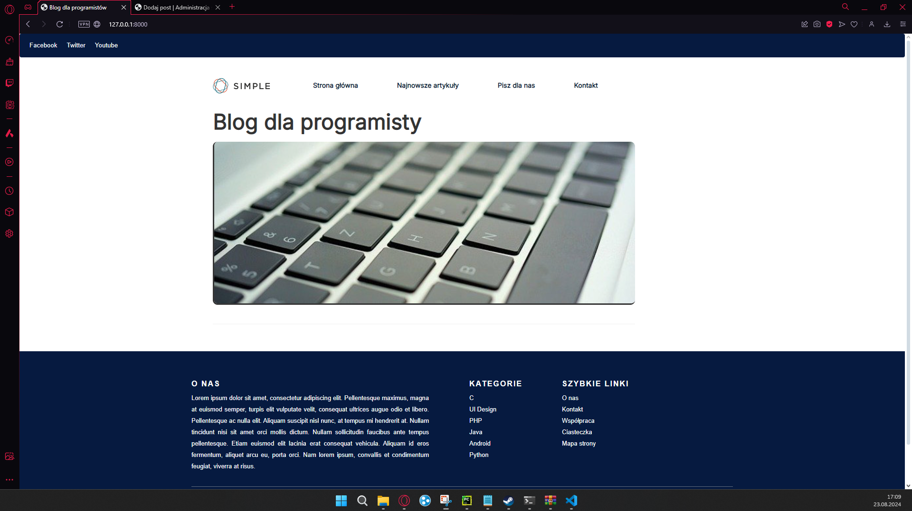
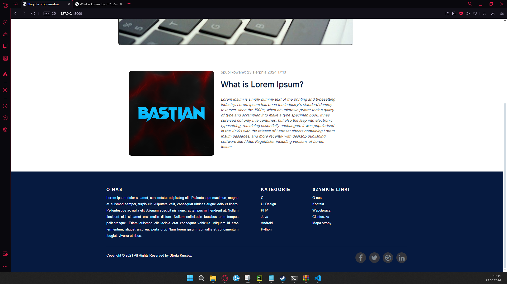
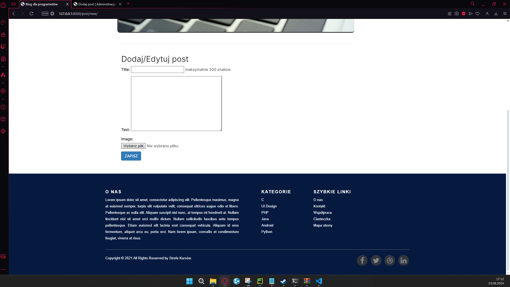
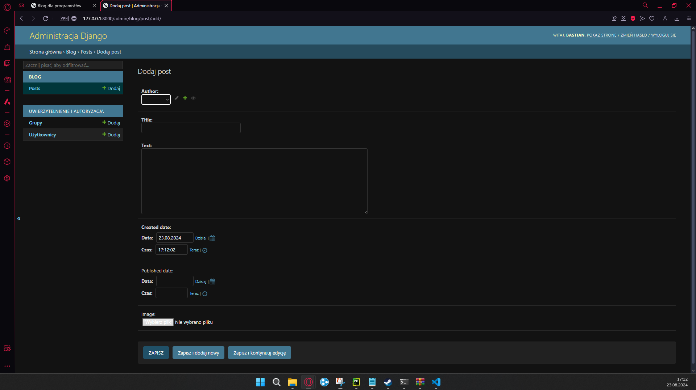

<h1>DjangoBlog</h1>

DjangoBlog to prosty blog napisany w Django z kursu ze strefy kursów. Projekt ten został stworzony w celu zaprezentowania podstawowych funkcjonalności Django i umożliwienia użytkownikom tworzenia i zarządzania własnymi wpisami na blogu.

<h2>Funkcjonalności</h2>
<ul>
    <li>Tworzenie i edycja wpisów na blogu</li>
    <li>Wyświetlanie listy wszystkich wpisów</li>
    <li>Wyświetlanie szczegółów pojedynczego wpisu</li>
</ul>

<h2>Technologie</h2>
<ul>
    <li>Django 3.x</li>
    <li>Python 3.x</li>
</ul>

<h2>Instalacja</h2>
<ol>
    <li>Sklonuj repozytorium: <code>git clone https://github.com/Bastian8004/DjangoBlog.git</code></li>
    <li>Zainstaluj zależności: <code>pip install -r requirements.txt</code></li>
    <li>Uruchom serwer: <code>python manage.py runserver</code></li>
    <li>Otwórz przeglądarkę i przejdź do adresu <a href="http://localhost:8000/">http://localhost:8000/</a></li>
</ol>

<h2>Użycie</h2>
<ul>
    <li>Zarejestruj się jako użytkownik</li>
    <li>Zaloguj się do systemu</li>
    <li>Dodaj nowy wpis na blogu</li>
    <li>Edytuj istniejący wpis</li>
    <li>Dodaj komentarz do wpisu</li>
</ul>

<h2>Poniżej zdjęcia z widoku przeglądarki</h2>

<h4>Widok strony głównej</h4>

<h4>Widok dodanego wpisu na blogu</h4>

<h4>Formularz dodający wpis</h4>

<h4>Widok z panelu administracyjnego</h4>

